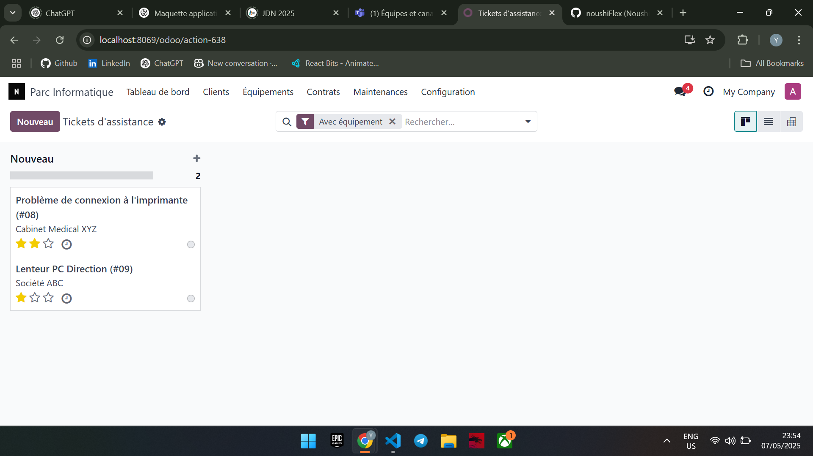
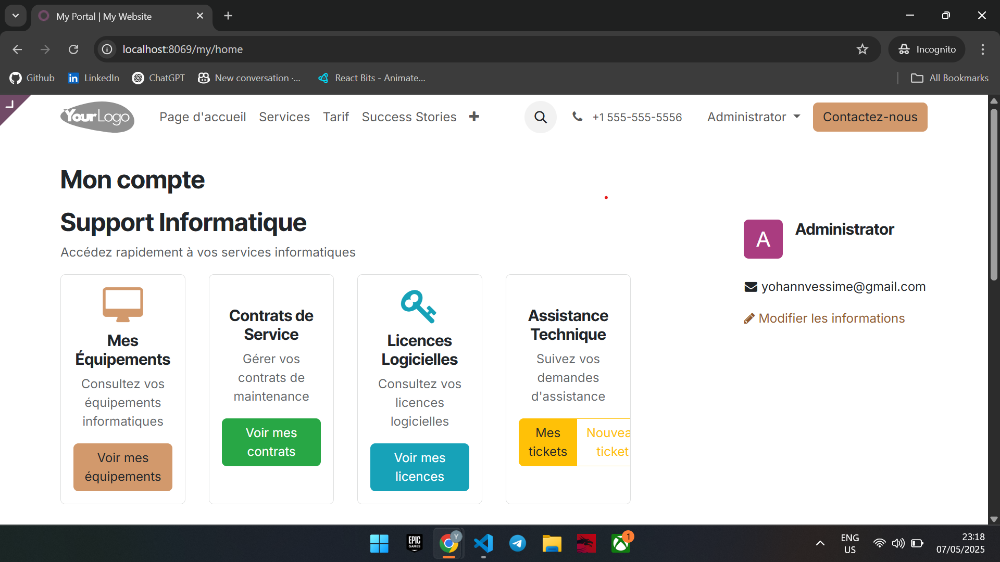

# Odoo IT Asset Management

## Vue d'ensemble
Module Odoo 18 pour la gestion complète de parc informatique destiné aux MSP (Managed Service Providers) et départements IT. Cette solution intégrée permet de gérer l'ensemble du cycle de vie des équipements informatiques, des contrats de service, des licences logicielles et des interventions techniques.

## Fonctionnalités principales

### Gestion des clients et sites
- Création et gestion des fiches clients avec multiples contacts
- Suivi des sites clients avec adresses et zones géographiques
- Classification des clients par niveau de service (Standard, Premium, VIP)
- Attribution de contrats spécifiques par site

### Inventaire des équipements
- Catalogue détaillé de tous les types d'équipements informatiques
- Suivi des numéros de série, modèles et garanties
- Gestion des composants et pièces détachées
- Attribution des équipements aux sites et utilisateurs
- Historique complet des interventions par équipement
- Alertes de fin de garantie et maintenance

### Contrats de service et maintenance
- Création de contrats de maintenance personnalisables
- Facturation automatique selon périodicité (mensuelle, trimestrielle, annuelle)
- Planification des interventions préventives
- Suivi des SLA (Service Level Agreements)
- Notifications automatiques avant expiration des contrats
- Génération de rapports d'intervention

### Gestion des licences logicielles
- Inventaire des logiciels déployés
- Suivi des licences et dates d'expiration
- Association des licences aux équipements et utilisateurs
- Alertes de renouvellement

### Service Desk intégré
- Intégration avec le module Helpdesk d'Odoo
- Création de tickets depuis le portail client
- Suivi des temps d'intervention
- Attribution des tickets aux techniciens selon compétences
- Historique complet des interventions

### Portail client
- Accès sécurisé pour les clients à leurs équipements
- Consultation des contrats et factures
- Création et suivi des tickets d'assistance
- Visualisation de l'inventaire du parc

### Tableau de bord et analyses
- Dashboard personnalisé pour techniciens et responsables
- Indicateurs clés de performance (KPI)
- Rapports d'activité et statistiques
- Planification des ressources techniques

## Installation

### Prérequis
- Odoo 18.0
- Modules dépendants: base, helpdesk, sale, account, hr, website, board, mail

### Procédure d'installation
1. Téléchargez le module depuis le dépôt GitHub
2. Placez le dossier `gestion_parc_informatique` dans le répertoire des addons personnalisés d'Odoo (`/custom_addons`)
3. Mettez à jour la liste des applications dans Odoo
4. Recherchez "Gestion Parc Informatique" et cliquez sur "Installer"
5. Configurez les paramètres initiaux après l'installation

## Configuration

### Configuration initiale
1. Créez les utilisateurs avec les rôles appropriés:
   - Groupe "Technicien parc informatique"
   - Groupe "Responsable parc informatique"
2. Configurez les séquences automatiques pour les références
3. Définissez les postes techniques dans la configuration RH
4. Paramétrez les modèles d'emails pour les notifications

### Paramètres avancés
- Configuration des niveaux de SLA
- Définition des types d'équipements
- Personnalisation des modèles de rapports d'intervention
- Configuration des règles d'alerte pour les maintenances

## Utilisation

### Processus typique
1. Création d'un client et de ses sites
2. Enregistrement des équipements et attribution aux sites
3. Mise en place des contrats de maintenance
4. Gestion des interventions et tickets
5. Facturation des prestations et renouvellements

### Fonctions quotidiennes
- Suivi des tickets en cours
- Planification des interventions des techniciens
- Gestion des alertes de maintenance préventive
- Suivi des contrats arrivant à échéance

## Sécurité
Le module implémente une gestion fine des droits d'accès:
- **Portail client**: consultation limitée à ses propres données (équipements, contrats, tickets)
- **Techniciens**: création et modification des interventions, consultation des équipements
- **Responsables**: accès complet à toutes les fonctionnalités et données

## Portail Client

Le module dispose d'une interface portail permettant aux clients de consulter leurs équipements, contrats et tickets.

### Accès au portail

Pour qu'un utilisateur puisse accéder au portail, il doit obligatoirement appartenir au groupe **Types d'utilisateur / Portail**. Pour configurer cet accès :

1. Allez dans **Paramètres → Utilisateurs & Sociétés → Utilisateurs**
2. Créez ou modifiez un utilisateur
3. Dans l'onglet **Accès**, assurez-vous que l'option **Portail** est cochée
4. Associez cet utilisateur au partenaire/client concerné

Les utilisateurs du portail auront uniquement accès à leurs propres données (équipements, contrats, tickets) selon les règles de sécurité définies dans le module.

## Documentation technique
La structure du module suit les standards Odoo avec:
- Modèles de données (models/)
- Vues XML (views/)
- Contrôleurs pour le portail web (controllers/)
- Règles de sécurité (security/)
- Données de démonstration (data/)